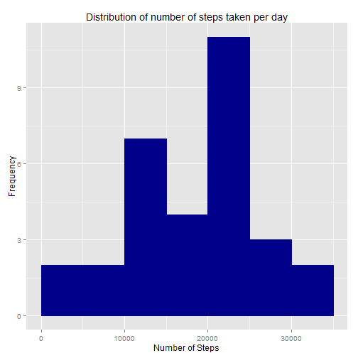
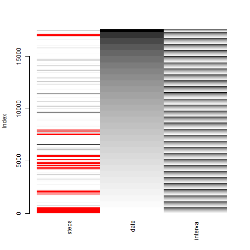
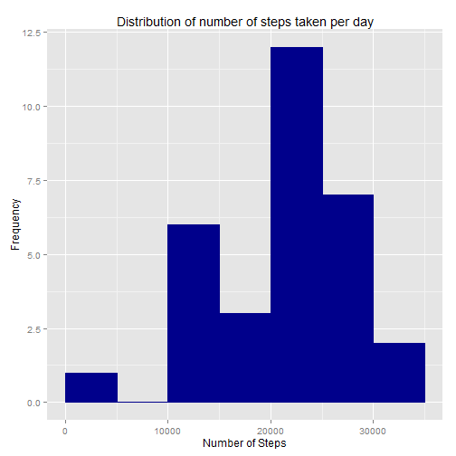
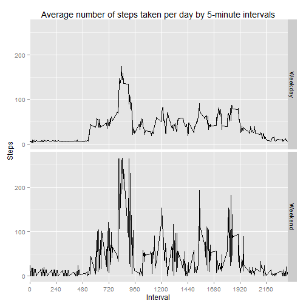

#Reproducible Research: Peer Assessment 1


## Loading and preprocessing the data

```r
require(ggplot2)
require(VIM)
DT <- read.csv(unz('activity.zip', 'activity.csv'))
DT$date <- as.Date(DT$date, '%Y-%M-%d')
```

##What is mean total number of steps taken per day?

```r
DT.date <- data.frame(steps = tapply(DT$steps, DT$date, sum, na.rm = TRUE))
qplot(DT.date$steps, data = DT.date, breaks = seq(0, 35000, by = 5000),
      xlab = 'Number of Steps', ylab = 'Frequency', 
      main = 'Distribution of number of steps taken per day',
      fill=I("darkblue"), col=I("darkblue"))
```

 

```r
mean(DT.date$steps)
```

```
## [1] 18406.71
```

```r
median(DT.date$steps)
```

```
## [1] 20525
```

##What is the average daily activity pattern?

```r
DT.interval <- data.frame(steps = tapply(DT$steps, DT$interval, mean, na.rm = TRUE))
DT.interval$interval <- as.numeric(row.names(DT.interval))

ggplot(data = DT.interval, 
       aes(x = DT.interval$interval, y = DT.interval$steps, group = 1)) +
       geom_line() + xlab('Interval') + ylab('Steps') + 
       ggtitle('Average number of steps taken per day by 5-minute intervals') + 
       scale_x_discrete(breaks = seq(0, 2400, by = 240))
```

 

```r
with(DT.interval, DT.interval[steps == max(steps) , "interval"])
```

```
## [1] 835
```


##Imputing missing values

```r
nrow(DT[!(complete.cases(DT)),])
```

```
## [1] 2304
```

```r
matrixplot(DT[order(DT$date, DT$interval),])
```

```
## Warning in hex(RGB(r, g, b), gamma = gamma, fixup = fixup, ...): 'gamma' is
## deprecated and has no effect
```

```
## Warning in hex(RGB(r, g, b), gamma = gamma, fixup = fixup, ...): 'gamma' is
## deprecated and has no effect
```

```
## Warning in hex(RGB(r, g, b), gamma = gamma, fixup = fixup, ...): 'gamma' is
## deprecated and has no effect
```

 
I don't see obvious pattern across intervals, but there are many missing values in certain dates (see plot).
Therefore the strategy is to calculate mean of the every 5-minute interval and fill the result in the missing value.

```r
DT.fill <- merge(DT[is.na(DT$steps), ], DT.interval, by = 'interval')
DT[is.na(DT$steps), 'steps'] <- DT.fill$steps.y

DT.dt <- data.frame(steps = tapply(DT$steps, DT$date, sum, na.rm = TRUE))
qplot(DT.dt$steps, data = DT.dt, breaks = seq(0, 35000, by = 5000),
      xlab = 'Number of Steps', ylab = 'Frequency', 
      main = 'Distribution of number of steps taken per day',
      fill=I("darkblue"), col=I("darkblue"))
```

 

```r
mean(DT.dt$steps)
```

```
## [1] 21185.08
```

```r
median(DT.dt$steps)
```

```
## [1] 22833
```
Values differ from the estimates from the first part of the assignment, because we included missing observations with some data. Therefore, number of steps per day increased.

##Are there differences in activity patterns between weekdays and weekends?

```r
DT$day.dm <- weekdays(DT$date) == c('Saturday','Sunday')
DT.weekly <- data.frame(tapply(DT$steps, 
                        list(DT$interval, DT$day.dm), 
                        mean))
DT.weekly$interval <- as.numeric(row.names(DT.weekly))
DT.weekly <- reshape(DT.weekly, 
                     varying = c('FALSE.','TRUE.'), 
                     dir = 'long', 
                     v.names ='steps',
                     timevar = 'day',
                     times = c('Weekday','Weekend'))
ggplot(data = DT.weekly, 
       aes(x = DT.weekly$interval, y = DT.weekly$steps, group = 1)) +
       geom_line() + xlab('Interval') + ylab('Steps') + 
       ggtitle('Average number of steps taken per day by 5-minute intervals') + 
       scale_x_discrete(breaks = seq(0, 2400, by = 240)) +
       facet_grid(day ~.)
```

 

